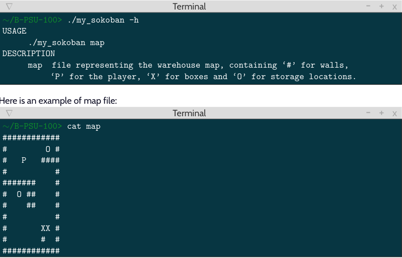

# MY_SOKOBAN
## Table of Contents
1. [General Info](#general-info)
2. [Technologies](#technologies)
3. [Installation](#installation)
4. [Overview](#Overview)
### General Info
***
This project aims to recreate the game of sokoban with the ncurses library. This project lasted 20 days from 18/11/2023 to 08/12/2023

## Technologies
***
A list of technologies used within the project:
* [LIBC](https://www.ibm.com/docs/en/i/7.5?topic=extensions-standard-c-library-functions-table-by-name): latest available
* [NCURSES](https://www.sbarjatiya.com/notes_wiki/index.php/Using_ncurses_library_with_C): latest available
## Installation
***
```
$ git clone git@github.com:matheo2027/my_sokoban.git
$ cd my_sokoban
$ make
$ ./my_sokoban -h
```
## Overview
***

